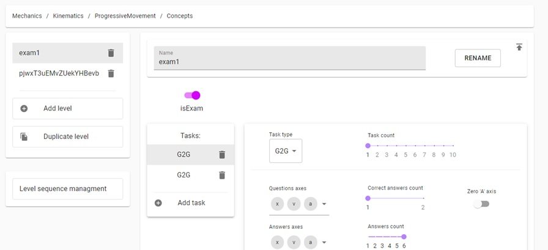

This project is additional tool for PhysMin app. 
====================

This tool written in React used to manage set of rules needed to generate tests in PhysMin app.
PhysMin app is learning application for a physic. Its provides a procedural generated tasks with answers options, on specific chapters of physic.
PhysMin was a bachelor`s work and a concept. Not in developing now.

Вспомогательный инструмент для приложения PhysMin. 
====================

Данный иснструмент написан на React и служит для состалвения правил генерации заданий в PhysMin app.
PhysMin - приложения для обучения физики. Предоставляет процедурно генерируемые задания с вариантами ответа, для определенных глав физики.
PhysMin - бакалаврская работа и концепт. Больше не находится в разработке.